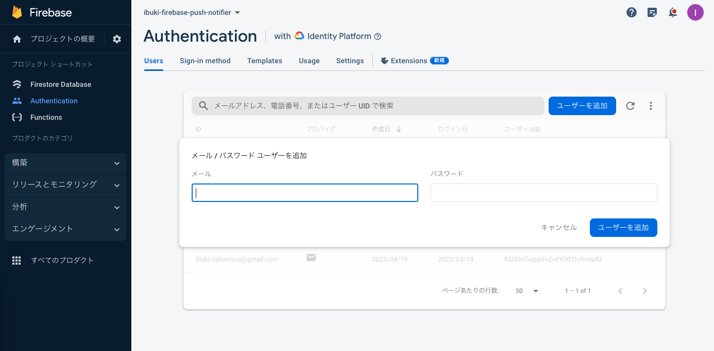

# 認証

- Firebase Authenticationを使用している。
  - Firebase AuthenticationはGoogle Identity Platformのラッパー (らしい)

## ユーザー登録

- Authenticationページに行き、ユーザー追加する。




## ログイン

- Identity PlatformのAPIがそのまま使える。
  - https://cloud.google.com/identity-platform/docs/use-rest-api?hl=ja#section-sign-in-email-password

### ログインの具体例

1.  プロジェクトの設定に行き、WebAPIキー (API_KEY) を取得する

2. APIリクエストして、IDトークンを取得して、クリップボードにコピー
```
API_KEY=xxxxxxxxxxxxxxxxxxxxxxxxxxxxxxxxxxxxxxx
curl "https://identitytoolkit.googleapis.com/v1/accounts:signInWithPassword?key=${API_KEY}" \
-H 'Content-Type: application/json' \
-d '{"email":"test@example.com","password":"password","returnSecureToken":true}' \
| jq .idToken -r | pbcopy && pbpaste
```

3. IDトークンをリクエストに使用する。

```
TOKEN=[PASTE HERE]
curl -X POST -H "Content-Type: application/json" \
  -H "authorization: Bearer ${TOKEN}" \
  -d '{"data": 333}' \
  http://localhost:5001/ibuki-firebase-push-notifier/us-central1/app
```
